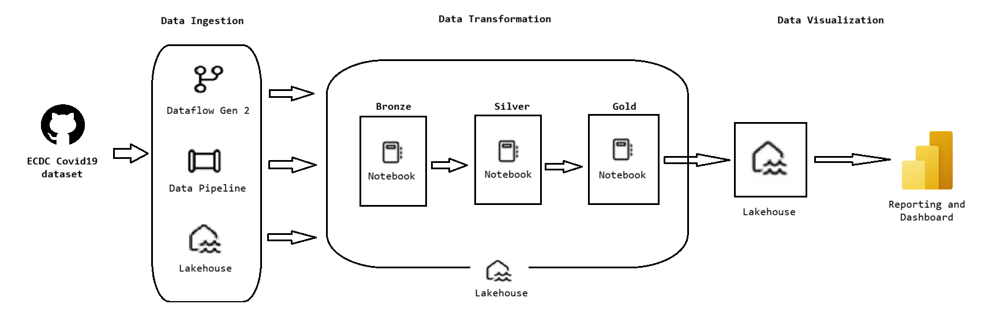
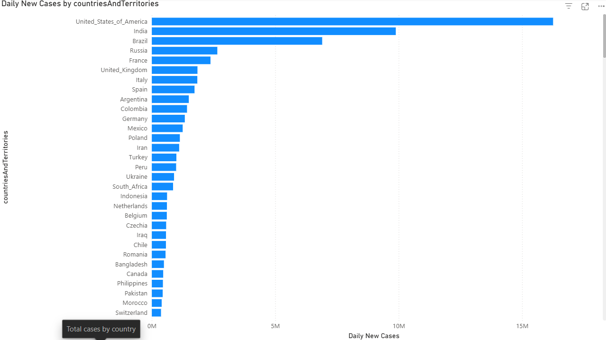
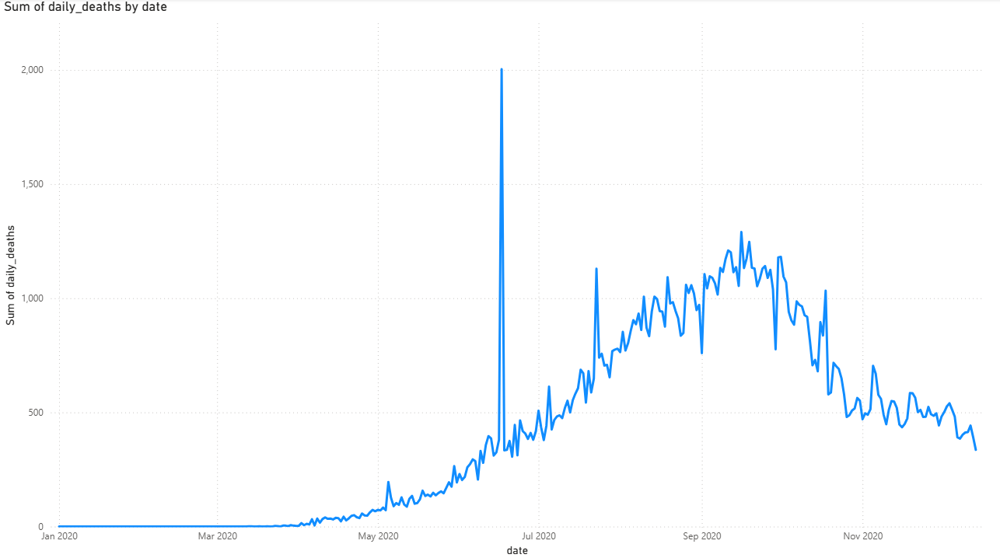
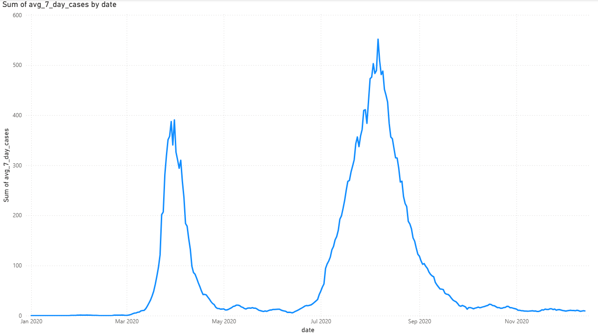
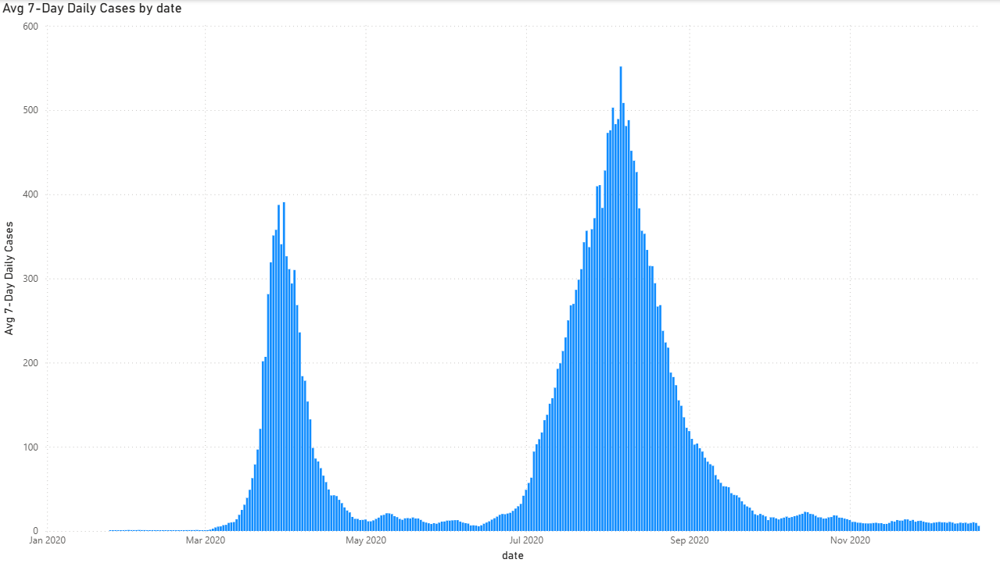
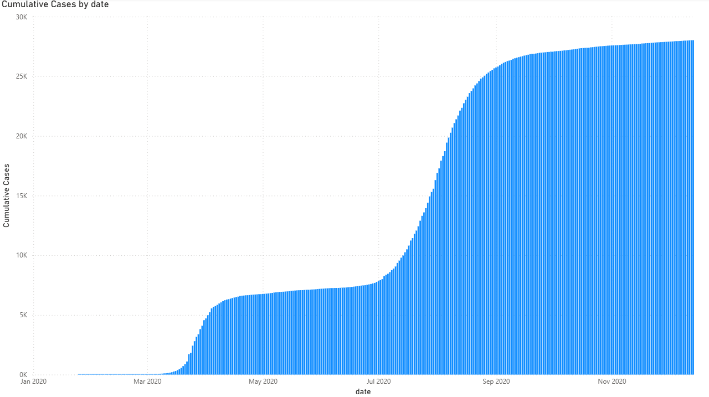
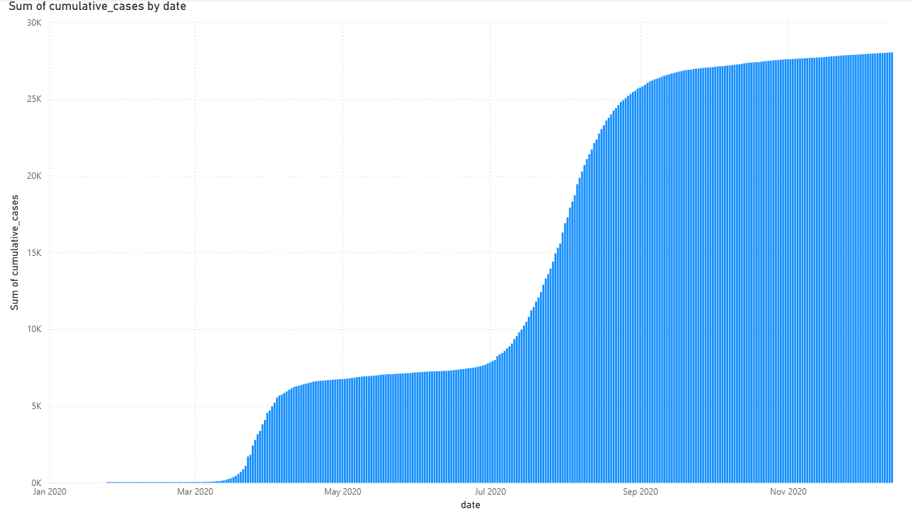
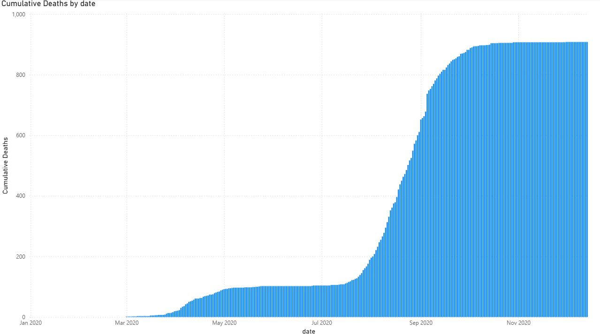
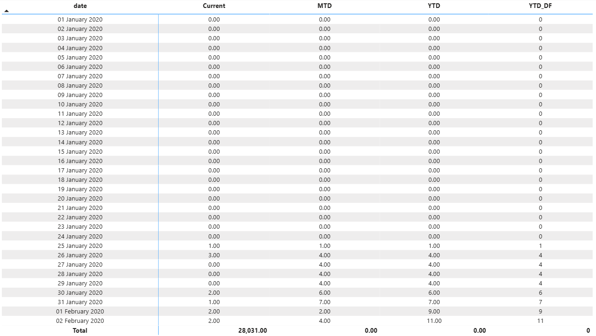
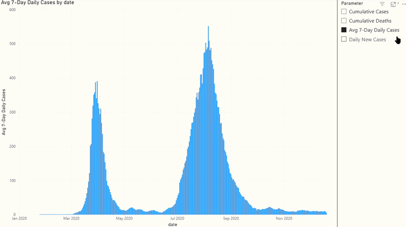

# 🦠 ECDC Covid-19 — End-to-End Data Analysis

> A full-stack data engineering and analytics project built on **Microsoft Fabric**, transforming raw ECDC Covid-19 data into an interactive Power BI dashboard using industry-standard Medallion Architecture.

---

## 📌 Table of Contents

- [Project Overview](#project-overview)
- [Architecture](#architecture)
- [Tech Stack](#tech-stack)
- [Project Walkthrough](#project-walkthrough)
  - [1. Data Ingestion — Dataflow Gen2](#1-data-ingestion--dataflow-gen2)
  - [2. Pipeline Ingestion from GitHub](#2-pipeline-ingestion-from-github)
  - [3. Dim Date Table — Notebook](#3-dim-date-table--notebook)
  - [4. Data Transformation — ECDC Cases Notebook](#4-data-transformation--ecdc-cases-notebook)
  - [5. Semantic Model](#5-semantic-model)
  - [6. Power BI Dashboard & DAX](#6-power-bi-dashboard--dax)
  - [7. Visualizations](#7-visualizations)
- [Lakehouse Tables](#lakehouse-tables)
- [Data Model](#data-model)
- [DAX Measures & Calculation Groups](#dax-measures--calculation-groups)
- [Dashboard Snapshots](#dashboard-snapshots)
- [Key Insights](#key-insights)
- [Folder Structure](#folder-structure)
- [Getting Started](#getting-started)

---

## Project Overview

This project demonstrates a **complete end-to-end data analytics pipeline** using the **ECDC (European Centre for Disease Prevention and Control)** Covid-19 dataset. Starting from raw CSV ingestion all the way through to an interactive Power BI dashboard, it covers every layer of the modern data stack — ingestion, transformation, modelling, and visualization — all within **Microsoft Fabric**.

The pipeline follows the **Medallion Architecture** (Bronze → Silver → Gold), ensuring clean, reliable, and performant data at every stage.

---

## Architecture



---

## Tech Stack

| Layer | Tool / Technology |
|---|---|
| Cloud Platform | Microsoft Fabric |
| Storage | OneLake (Lakehouse) |
| Ingestion | Dataflow Gen2, Fabric Data Pipeline |
| Transformation | PySpark Notebooks |
| Modelling | Power BI Semantic Model (Direct Lake) |
| Reporting | Power BI |
| DAX | Measures, Calculation Groups, Time Intelligence |
| Data Source | ECDC Covid-19 Open Dataset |

---

## Project Walkthrough

### 1. Data Ingestion — Dataflow Gen2

Raw ECDC Covid-19 data (`ecdc_cases.csv`) was uploaded from device into **Dataflow Gen2** inside Microsoft Fabric. The following Power Query transformations were applied:

- Promoted headers
- Changed column data types (dates, integers)
- Renamed columns for consistency
- Removed duplicates and nulls
- Added a custom `Source_name` column
- Reordered columns: `Source_name`, `reporting_date`, `day`, `month`, `year`, `cases`, `deaths`, `countries_and_territories`, `geo_id`, `country_territory_code`

The output was written directly to the Lakehouse as the **`covid_stg`** table (Bronze layer).

---

### 2. Pipeline Ingestion from GitHub

A **Fabric Data Pipeline** was created to fetch the Covid-19 dataset directly from a public GitHub repository using an HTTP connector. The pipeline:

- Pulled raw CSV data from GitHub
- Loaded it into the Lakehouse as **`covid_stg_partitioned`**
- Partitioned the table by `countriesAndTerritories` and `year` columns for efficient querying at scale

---

### 3. Dim Date Table — Notebook

A **`dim_date`** dimension table was generated programmatically using a PySpark notebook. This table covers the full reporting period and includes:

| Column | Description |
|---|---|
| `date` | Full date |
| `date_key` | Integer surrogate key |
| `day_name` | Name of the day (Monday, etc.) |
| `day_of_month` | Numeric day |
| `day_of_week` | Day index |
| `month` | Month number |
| `quarter` | Quarter (Q1–Q4) |
| `week_of_year` | ISO week number |
| `year` | Calendar year |

---

### 4. Data Transformation — ECDC Cases Notebook

The **`ECDC_cases_transformation`** notebook performed multi-layer transformations:

**Silver Layer (`covid_silver_transformed_data`):**
- Cast and validated all column types
- Constructed a proper `reporting_date` from `day`, `month`, `year` columns
- Standardised country codes and territory names
- Removed records with null or negative case/death counts
- Joined with location metadata

**Gold Layer (`covid_gold_aggregated_kpis`):**
- Aggregated daily metrics per country per date
- Computed pre-aggregated KPIs:
  - `daily_cases`, `daily_deaths`
  - `cumulative_cases`, `cumulative_deaths`
  - `avg_7_day_cases`, `avg_7_day_deaths`
- Added `date_key` and `location_key` foreign keys for the semantic model
- Stored `load_date` for audit/lineage tracking

---

### 5. Semantic Model

A **Power BI Semantic Model** was built in Direct Lake mode over three Gold layer tables:

- **`covid_gold_aggregated_kpis`** — Fact table with all KPIs
- **`dim_date`** — Date dimension (one-to-many with fact)
- **`dim_location`** — Location/SCD2 dimension (one-to-many with fact)

Relationships:
- `covid_gold_aggregated_kpis[date_key]` → `dim_date[date_key]` (many-to-one)
- `covid_gold_aggregated_kpis[location_key]` → `dim_location[location_key]` (many-to-one)

A **Time Intelligence** calculation group and a **Parameter** table were also added for dynamic filtering.

---

### 6. Power BI Dashboard & DAX

An interactive Power BI dashboard was built with custom **DAX Measures** and a **Calculation Group** for time intelligence.

---

### 7. Visualizations

The dashboard includes the following charts:

| Chart | Description |
|---|---|
| `Australia_avg_7_days_cases_trends` | 7-day rolling average case trend for Australia |
| `Australia_avg_7_days_cases_trends_using_dax` | Same trend using custom DAX measure |
| `Australia_cumulative_cases` | Running total of cases — Australia |
| `Australia_cumulative_cases_using_dax` | DAX-driven cumulative cases |
| `Australia_cumulative_deaths` | Running total of deaths — Australia |
| `calc_groups_daily_cases` | Daily cases breakdown using calculation groups |
| `indian_covid_death_trends` | Death trend analysis for India |
| `total_cases_by_country` | Global country-level comparison chart |
| `australia_visualisation_using_parameters.mp4` | 🎥 Dynamic video showing all charts updating interactively using parameter slicers |

---

## Lakehouse Tables

The **`Covid_LH`** Lakehouse contains the following tables under the `dbo` schema:

```
Covid_LH
└── Tables
    └── dbo
        ├── covid_bronze_raw_data          ← Raw ingested data
        ├── covid_gold_aggregated_kpis     ← Final KPI fact table
        ├── covid_silver_transformed_data  ← Cleaned intermediate layer
        ├── covid_stg                      ← Dataflow Gen2 output
        ├── covid_stg_partitioned          ← Pipeline output (partitioned)
        ├── dim_date                       ← Date dimension
        └── dim_location                   ← Location SCD2 dimension
```

---

## Data Model

```
dim_location ──(1:*)── covid_gold_aggregated_kpis ──(*:1)── dim_date
    │                          │
    │                          │
 location_key              date_key
 countriesAndTerritories   daily_cases
 continentExp              daily_deaths
 iso_country               cumulative_cases
 effective_start_date      cumulative_deaths
 effective_end_date        avg_7_day_cases
 current_flag              avg_7_day_deaths
                           load_date
```

---

## DAX Measures & Calculation Groups

### Measures

```dax
-- 7-day rolling average
Avg 7-Day Daily Cases =
VAR DateWindow = DATESINPERIOD(dim_date[date], MAX(dim_date[date]), -7, DAY)
RETURN AVERAGEX(DateWindow, CALCULATE(SUM(covid_gold_aggregated_kpis[daily_cases])))

-- Cumulative Cases (respects slicer context)
Cumulative Cases =
VAR CurrentDate = MAX(covid_gold_aggregated_kpis[date_key])
RETURN CALCULATE(
    SUM(covid_gold_aggregated_kpis[daily_cases]),
    FILTER(ALLSELECTED('covid_gold_aggregated_kpis'),
           covid_gold_aggregated_kpis[date_key] <= CurrentDate))

-- Cumulative Deaths
Cumulative Deaths =
VAR CurrentDate = MAX(covid_gold_aggregated_kpis[date_key])
RETURN CALCULATE(
    SUM(covid_gold_aggregated_kpis[daily_deaths]),
    FILTER(ALLSELECTED('covid_gold_aggregated_kpis'),
           covid_gold_aggregated_kpis[date_key] <= CurrentDate))

-- Daily New Cases (null-safe)
Daily New Cases =
VAR CurrentCases = SUM(covid_gold_aggregated_kpis[daily_cases])
RETURN IF(NOT(ISBLANK(CurrentCases)), CurrentCases, 0)
```

### Calculation Group — Time Intelligence

| Calculation Item | DAX Expression |
|---|---|
| `Current` | `SELECTEDMEASURE()` |
| `MTD` | `CALCULATE(SELECTEDMEASURE(), DATESMTD('dim_date'[date]))` |
| `YTD` | `CALCULATE(SELECTEDMEASURE(), DATESYTD('dim_date'[date]))` |
| `YTD_DF` | `CALCULATE(SELECTEDMEASURE(), DATESYTD('dim_date'[date]))` |

---

## Dashboard Snapshots

### Total Cases by Country


### Indian Covid Death Trends


### Australia — Avg 7-Day Cases Trend


### Australia — Avg 7-Day Cases Trend (Using DAX)


### Australia — Cumulative Cases (Using DAX)


### Australia — Cumulative Cases


### Australia — Cumulative Deaths


### Daily Cases with Calculation Groups


### Australia Visualisation Using Parameters



---

## Key Insights

- 🌏 **Australia** showed distinct wave patterns with significant case spikes, visible in rolling 7-day averages
- 🇮🇳 **India** experienced sharp death trend escalations during peak waves
- 📈 **Cumulative cases** grew non-linearly, driven by a few high-volume countries
- 🗓️ **MTD / YTD** calculation groups enabled dynamic period comparisons without duplicate measures
- 🎛️ **Parameter slicers** allowed real-time switching of metrics and geographies across all visuals simultaneously

---

## Folder Structure

```
ECDC-Covid19-Analysis/
├── notebooks/
│   ├── ECDC_cases_transformed.ipynb      ← Silver & Gold transformation
│   └── dim_date_creation.ipynb           ← Date dimension generator
├── dataflows/
│   └── covid_stg_dataflow.json           ← Dataflow Gen2 export
├── pipelines/
│   └── github_ingestion_pipeline.json    ← Fabric pipeline definition
├── semantic_model/
│   └── Covid19_SemanticModel.pbism       ← Power BI semantic model
├── dashboard/
│   └── Covid19_Dashboard.pbix            ← Power BI report
├── visualizations/
│   ├── Australia_avg_7_days_cases_trends.png
│   ├── Australia_avg_7_days_cases_trends_using_dax.png
│   ├── Australia_cumulative_cases.png
│   ├── Australia_cumulative_cases_using_dax.png
│   ├── Australia_cumulative_deaths.png
│   ├── calc_groups_daily_cases.png
│   ├── indian_covid_death_trends.png
│   ├── total_cases_by_country.png
│   └── australia_visualisation_using_parameters.mp4
├── measures/
│   └── measure_and_calculation.txt       ← All DAX measures & calc groups
└── README.md
```

---

## Getting Started

### Prerequisites

- Microsoft Fabric workspace with Lakehouse enabled
- Power BI Desktop (for local `.pbix` editing)
- Access to ECDC Covid-19 dataset CSV

### Steps to Reproduce

1. **Create a Lakehouse** named `Covid_LH` in your Fabric workspace
2. **Run Dataflow Gen2** — upload `ecdc_cases.csv` and apply transformations, output to `covid_stg`
3. **Run the Pipeline** — configure the GitHub HTTP source, output to `covid_stg_partitioned` with country/year partitioning
4. **Run `dim_date` notebook** — generates the date dimension table in the Lakehouse
5. **Run `ECDC_cases_transformed.ipynb`** — applies Silver and Gold transformations
6. **Create the Semantic Model** — connect `covid_gold_aggregated_kpis`, `dim_date`, `dim_location`; add relationships and the Time Intelligence calculation group
7. **Build the Power BI Dashboard** — import the `.pbix` or recreate visuals using the provided DAX measures

---

## Author

Built with ❤️ using **Microsoft Fabric**, **PySpark**, **Power BI**, and **DAX**.

> *"Turning raw pandemic data into clear, actionable insights — one transformation at a time."*

---

*Dataset Source: [ECDC — European Centre for Disease Prevention and Control](https://www.ecdc.europa.eu/en/covid-19/data)*